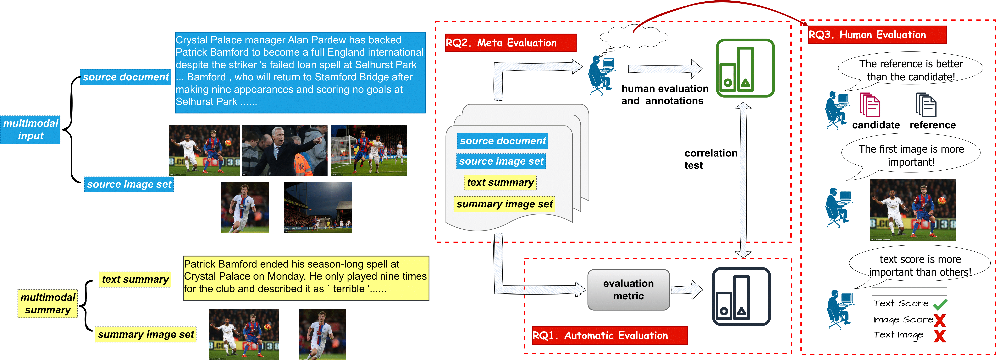

# MSMO-Eval
This repository contains the dataset and code we used in our NAACL paper: Automatic, Meta and Human Evaluation for Multimodal Summarization with Multimodal Output.

## Overview

MSMO (Multimodal Summarization with Multimodal Output) extracts the most important information from both source document and images to generate a multimodal summary. In this work, we investigate the following research questions:
1. **Automatic Evaluation**: How to properly evaluate the quality of a multimodal summary? We propose **mLLM-EVAL**, a **m**ultimodal **LLM**s based **EVAL**uation metric for MSMO.
2. **Meta-Evaluation**: How to evaluate the evaluation metrics for multimodal summarization? We create a MSMO meta-evaluation benchmark dataset by asking three annotators to assess the quality of multimodal summaries, which is followed by analyzing the quality of the MSMO metrics through correlation test.
3. **Human Evaluation**: Are there any cognitive biases in human evaluation for multimodal summarization? We hypothesize and verify three types of cognitive biases in human evaluation: anchoring bias; lead bias in image selection; text bias in overall evaluation. We also incorporate our findings to provide more objective and unbiased human annotations for our meta-evaluation.

## Data
We release our meta-evaluation dataset in this link (will update soon).

There are 1,562 multimodal summarization examples in our meta-evaluation dataset, where each example is annotated in (1) Relevance; (2) Coherence; (3) Consistency; (4) Fluency; (5) Summary Images Quality; (5) Text Summary-Summary Images Relevance; (6) Overall Quality.

## Code
We will update our code soon.

## Acknowledgments

